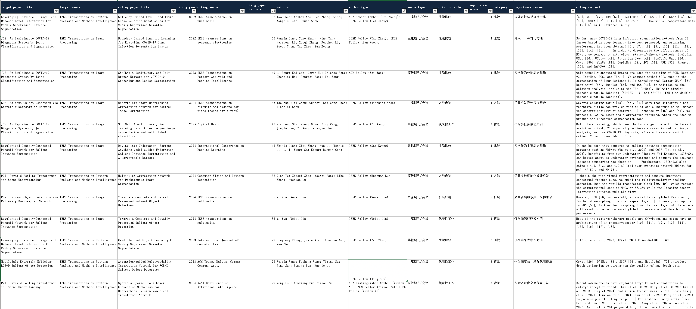

# CiteSelect

CiteSelect is a citation mining pipeline for finding representative citations of a target researcher.


It fetches the researcher's papers from Semantic Scholar, collects citing papers and citation contexts, runs LLM-based refinement, enriches author identity signals with fellow/member datasets, and exports a reviewable Excel workbook for grant / talent / evaluation materials.

Below is an example of the exported review workbook.




## Install

```bash
python3 -m venv .venv
source .venv/bin/activate
pip install -r requirements.txt
```

## Configure

Create a local config first:

```bash
cp config.example.yaml config.yaml
```

At minimum, fill:

- `author_url` or `author_id`
- `s2_api_key` which is the Semantic Scholar API key
- `openrouter_api_key` if using the default OpenRouter setup

### Get `s2_api_key`

Official page:

- https://www.semanticscholar.org/product/api

### Get `author_url` / `author_id`

Open the target researcher's Semantic Scholar author page and copy the URL.

Example:

```text
https://www.semanticscholar.org/author/Yu-Huan-Wu/48607882
```

In this example:

- `author_url` is the full URL
- `author_id` is the numeric suffix at the end: `48607882`

This repository can parse `author_id` automatically from `author_url`, so usually setting only `author_url` is enough.

Reference docs:

- https://api.semanticscholar.org/api-docs/graph
- https://www.semanticscholar.org/faq#api-key-form

## Usage

Fetch the target researcher's publication list:

```bash
python3 collect.py fetch-publications
```

Fetch all citations:

```bash
python3 collect.py fetch-citations
```

Run citation refinement:

```bash
python3 collect.py refine-citations --no-echo-llm
```

Export the Excel workbook:

```bash
python3 collect.py export-excel
```

Run the full pipeline:

```bash
python3 collect.py all
```

Useful debug flow:

```bash
python3 collect.py fetch-citations --first-n 1 --per-paper-max 100
python3 collect.py refine-citations --first-n 1 --no-echo-llm
python3 collect.py export-excel --first-n 1
```

## Output

Main output files:

- `outputs/citations/`: raw citing papers and contexts
- `outputs/citations_refined/`: refined citation judgments
- `outputs/reports/representative_citations.xlsx`: final Excel workbook

Main Excel columns include:

- `citing paper title`
- `citing venue`
- `authors`
- `author type`
- `citation role`
- `importance score`
- `citing content`

## Notes

- `config.yaml` is ignored by git because it may contain secrets.
- Runtime outputs are written to `outputs/`.
- `academic-awards/data/` is vendored and used for local fellow/member matching.

## Acknowledgments

- Academic award / fellow datasets are based on `academic-awards` by xiaohk:
  https://github.com/xiaohk/academic-awards
- Citation graph, author profiles, and citing-context retrieval rely on Semantic Scholar:
  https://www.semanticscholar.org/
